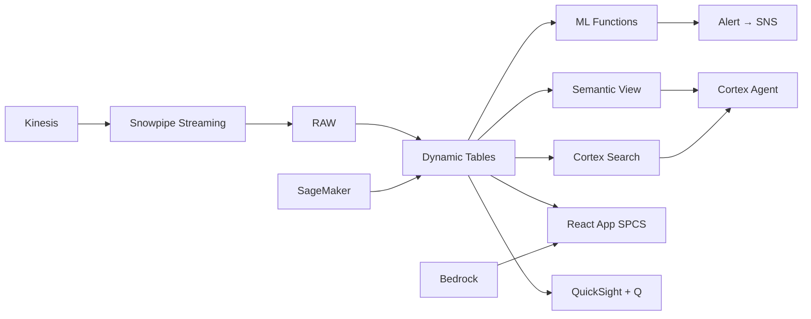

# Hospital Capacity & Revenue Optimization

Hospital capacity intelligence for 12 Thai private hospitals — Kinesis streams bed census data, ML.FORECAST predicts admissions 14 days ahead, and Alerts notify operations when capacity thresholds are breached.

## Architecture

Thailand's private hospital group operates 12 hospitals with 3,200 beds — but reactive capacity management means 3 hospitals hit capacity limits while others have headroom, costing ฿1.4B in annual revenue opportunity. ML-powered admission forecasting and revenue optimization transforms operations from reactive to predictive.



## Snowflake Capabilities

| Capability | Implementation |
|-----------|---------------|
| Dynamic Tables | REALTIME_BED_STATUS / ADMISSION_TIMESERIES / REVENUE_PER_BED_DAY / OR_UTILIZATION |
| ML Functions | ML.FORECAST + ML.ANOMALY_DETECTION |
| Cortex AI | COMPLETE, AI_CLASSIFY, AI_EXTRACT |
| Cortex Search | 12000 documents indexed |
| Cortex Agent | HOSPITAL_CAPACITY_AGENT |
| Semantic View | HOSPITAL_CAPACITY_ANALYTICS |
| React App (SPCS) | 5 tabs + DemoGuide |


## AWS Services

| Service | Role in Demo |
|---------|-------------|
| Amazon Kinesis | Stream real-time bed census data from hospital ADT systems (500K events) |
| Amazon SageMaker | Admission forecasting and length-of-stay prediction models |
| Amazon Bedrock (Claude) | Generate capacity planning narratives and revenue reports |
| Amazon EventBridge | Trigger capacity alerts and forecast refresh schedules |
| Amazon SNS | Alert operations team on capacity threshold breaches |
| Amazon QuickSight + Q | Hospital operations dashboard with NL queries |


## Personas

| Persona | Role | Key Questions |
|---------|------|---------------|
| **Dr. Thanaporn Pongcharoen** | Group COO | "What's our bed utilization across the group today?" "Which hospitals are approaching capacity limits?" |
| **Worawit Thammachot** | Hospital Operations Director | "What's tomorrow's predicted census vs capacity?" "Which patients are likely to discharge in the next 24 hours?" |


## Data

| Table | Rows | Description |
|-------|------|-------------|
| HOSPITALS | 12 | Private hospitals in group (Bangkok, Samut Prakan, Chiang Mai) |
| BED_CENSUS | 500,000 | Real-time bed status data (occupied, available, cleaning) streamed via Kinesis |
| ADMISSIONS | 180,000 | 12 months of patient admissions with diagnosis, department, LOS |
| SURGERIES | 45,000 | Surgical cases with OR time, team, and scheduling data |
| REVENUE_DATA | 180,000 | Revenue per admission (room, procedures, pharmacy, supplies) |
| STAFFING | 8,760 | Daily staffing levels by department and hospital |
| CANCELLATIONS | 12,000 | Elective surgery and admission cancellations with reasons |
| THAI_PRIVATE_HEALTH | 10 | Thailand private healthcare market data |


## Build Instructions

### Prerequisites
- Snowflake account with ACCOUNTADMIN access
- Cortex AI enabled (ML Functions, Search, Agent)
- Warehouse: HOSPITAL_WH (Medium)
- AWS CLI with access (us-west-2)

### Deployment

```bash
snowsql -f snowflake/00_setup.sql
snowsql -f snowflake/01_marketplace_install.sql
snowsql -f snowflake/02_raw_tables.sql
snowsql -f snowflake/03_staging.sql
snowsql -f snowflake/04_dynamic_tables.sql
snowsql -f snowflake/05_search.sql
snowsql -f snowflake/06_ml_models.sql
snowsql -f snowflake/07_semantic_view.sql
snowsql -f snowflake/08_agent.sql
```

### React App (SPCS)
```bash
cd app && npm ci && npm run build
docker build -t aws-thailand-healthcare-hospital-capacity-app .
docker push bdiqc8sm-default.registry.snowflakecomputing.com/hospital_capacity/app/aws_thailand_healthcare_hospital_capacity/app:latest
```

### Demo Mode
Open the app URL with `?demo=true` for presenter view.

## Build Modes

### Snowflake Only
Run scripts 00-08 (skip AWS-specific integration). Uses:
- **Snowpipe Streaming SDK** instead of Amazon Kinesis
- **ML.FORECAST (native)** instead of Amazon SageMaker
- **Cortex Complete** instead of Amazon Bedrock (Claude)
- **Alerts + Tasks** instead of Amazon EventBridge
- **Alerts + Notification Integration** instead of Amazon SNS
- **Snowflake Intelligence (Cortex Analyst)** instead of Amazon QuickSight + Q

### Full AWS + Snowflake
Run all scripts including AWS integration. Deploy QuickSight dashboard from `quicksight/`.

## Business Impact

Industry research and Snowflake customer outcomes:
- **Thailand's private hospital market valued at ฿280B (US$8B) with 340+ facilities** — [Krungsri Research](https://www.krungsri.com/en/research)
- **ML-powered capacity planning improves bed utilization by 8-15% and reduces cancellations by 25%** — [McKinsey Healthcare Operations](https://www.mckinsey.com/industries/healthcare/our-insights)
- **Bangkok Dusit Medical Services (BDMS) operates 50 hospitals with 8,400 beds across Thailand** — [BDMS](https://www.bdms.co.th/en)
- **Optimized surgical scheduling increases OR revenue by 15-20% without additional capacity** — [Harvard Business Review Health](https://hbr.org/topic/health)


## Key Demo Numbers

- **84% utilization** group average (3 hospitals above 90% — capacity risk)
- **฿1.4B gap** annual revenue opportunity from sub-optimal case mix (US$40M)
- **8.2% cancellation** rate costing ฿340M in lost revenue
- **14-day forecast** admission predictions by hospital and department
- **500K events** bed census updates streamed via Kinesis
- **3,200 beds** monitored across 12 private hospitals


## License

Apache 2.0 — See [LICENSE](LICENSE) for details.

This is a personal demo project and is not an official Snowflake offering. It comes with no support or warranty.